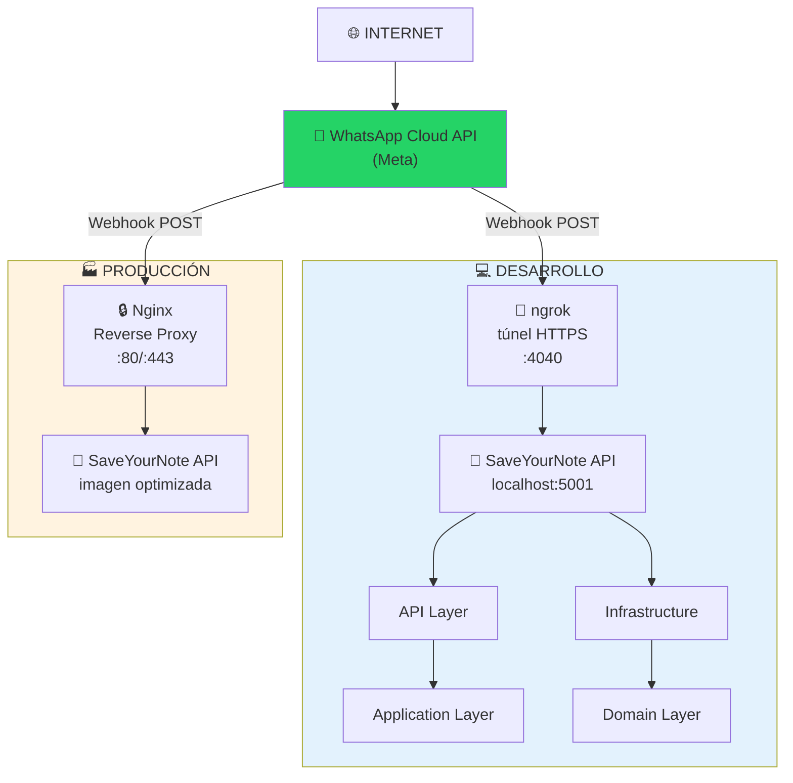
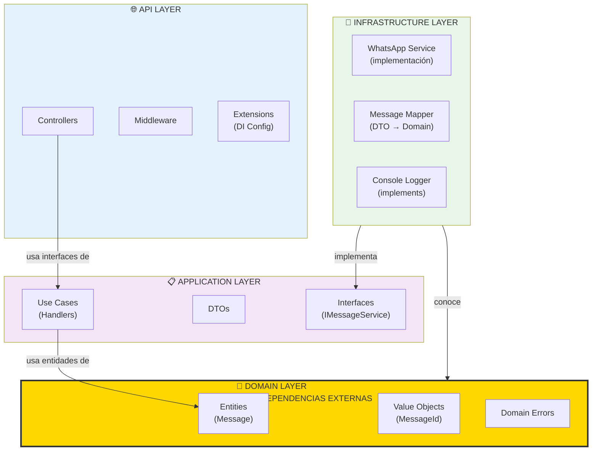
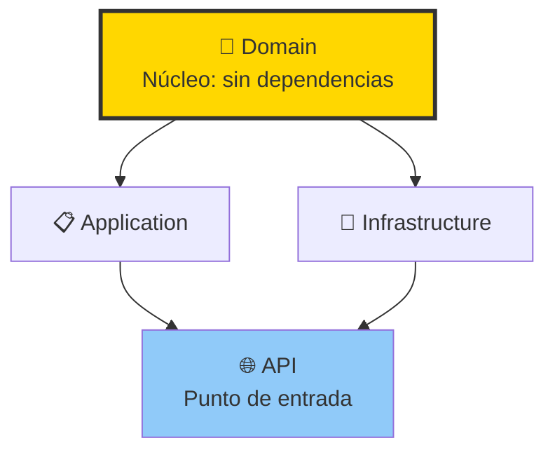
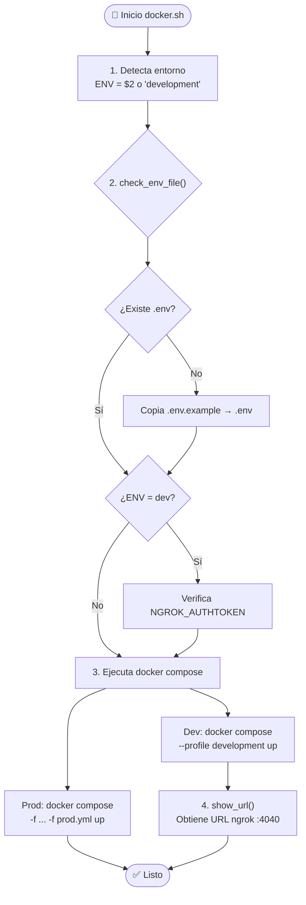
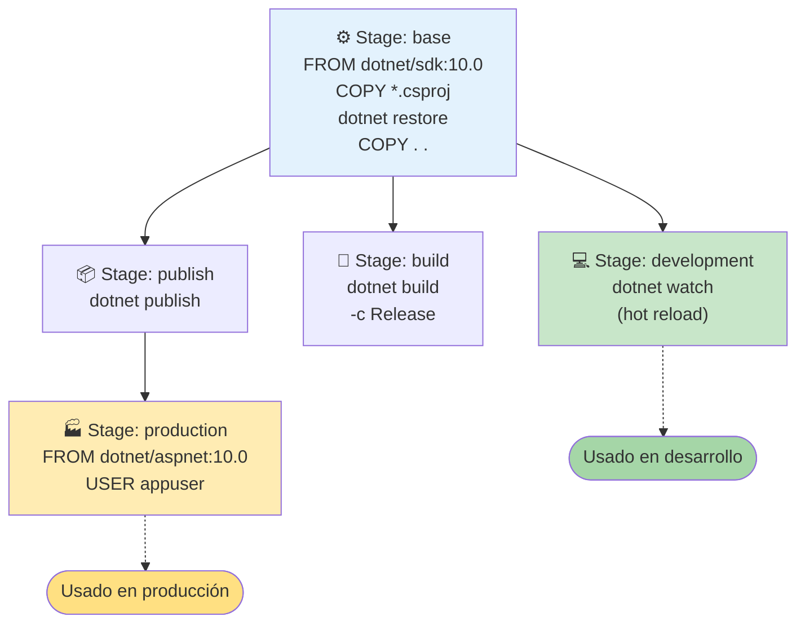
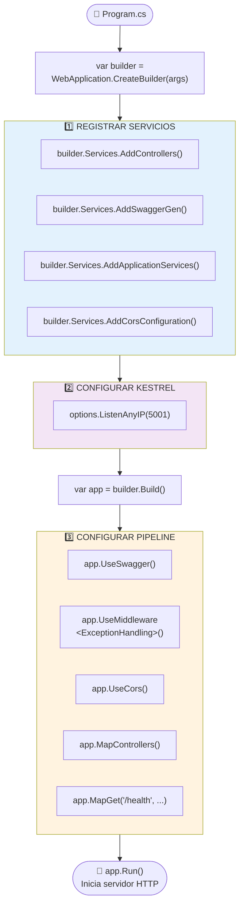
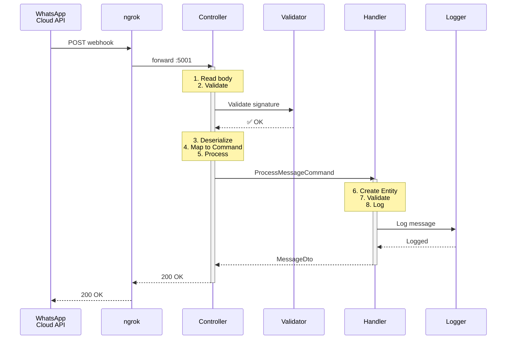
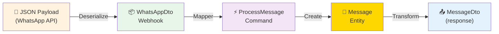
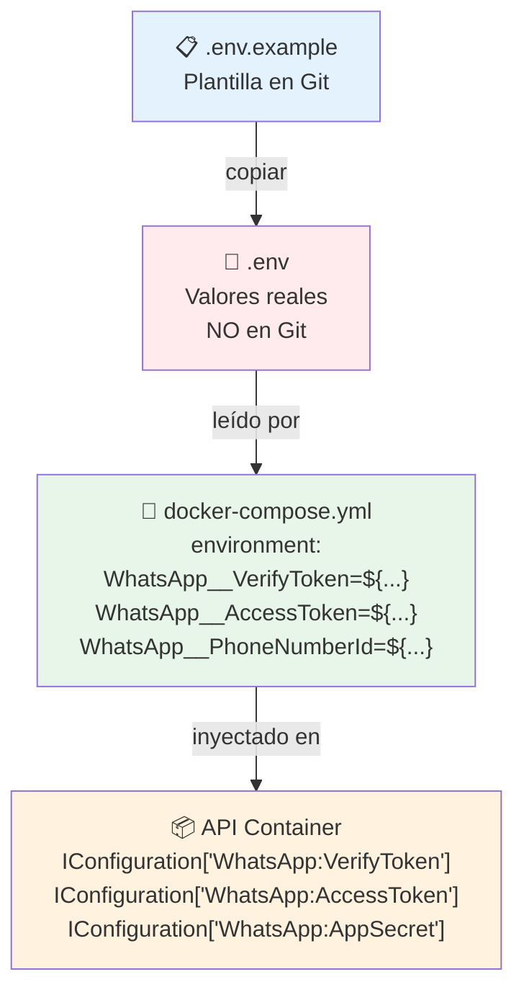
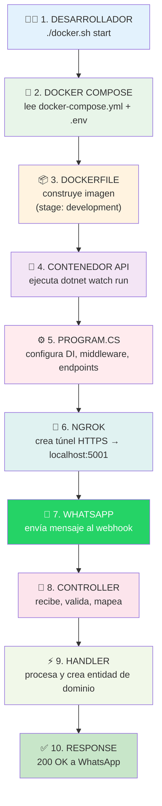

# 🏗️ Arquitectura y Flujo de SaveYourNote

Este documento explica la estructura completa de la aplicación SaveYourNote, cómo se comunican sus componentes y el flujo de arranque.

---

## 📑 Índice

1. [Visión General](#visión-general)
2. [Estructura de Directorios](#estructura-de-directorios)
3. [Arquitectura de Capas](#arquitectura-de-capas-clean-architecture)
4. [Flujo de Arranque](#flujo-de-arranque)
5. [Configuración Docker](#configuración-docker)
6. [Flujo de Mensajes WhatsApp](#flujo-de-mensajes-whatsapp)
7. [Variables de Entorno](#variables-de-entorno)
8. [Tecnologías y Patrones](#tecnologías-y-patrones)

---

## 🎯 Visión General

SaveYourNote es una API que recibe mensajes de WhatsApp, los procesa y los almacena organizados. La arquitectura sigue el patrón **Clean Architecture** con separación clara entre capas.

### Diagrama de Alto Nivel



---

## 📁 Estructura de Directorios

```
saveyournote/
├── docker.sh                    # Script de gestión Docker
├── docker-compose.yml           # Configuración desarrollo
├── docker-compose.prod.yml      # Override producción
├── SaveYourNote.sln             # Solución .NET
├── .env                         # Variables de entorno (no en git)
├── .env.example                 # Plantilla de variables
│
├── nginx/                       # Configuración Nginx
│   ├── nginx.conf               # Config reverse proxy
│   └── certs/                   # Certificados SSL
│
└── src/                         # Código fuente
    │
    ├── SaveYourNote.Api/        # 🌐 CAPA DE PRESENTACIÓN
    │   ├── Controllers/
    │   │   └── WhatsAppWebhookController.cs
    │   ├── Extensions/
    │   │   └── ServiceCollectionExtensions.cs
    │   ├── Middleware/
    │   │   └── ExceptionHandlingMiddleware.cs
    │   ├── Program.cs           # ⭐ Entry Point
    │   ├── Dockerfile           # Multi-stage build
    │   └── appsettings.json
    │
    ├── SaveYourNote.Application/ # 📋 CAPA DE APLICACIÓN
    │   ├── DTOs/
    │   │   └── MessageDto.cs
    │   ├── Interfaces/
    │   │   ├── IMessageService.cs
    │   │   └── IMessageLogger.cs
    │   ├── UseCases/
    │   │   └── ProcessMessage/
    │   │       ├── ProcessMessageCommand.cs
    │   │       └── ProcessMessageHandler.cs
    │   └── Errors/
    │       └── ApplicationErrors.cs
    │
    ├── SaveYourNote.Domain/      # 💎 CAPA DE DOMINIO
    │   ├── Entities/
    │   │   └── Message.cs
    │   ├── ValueObjects/
    │   │   ├── MessageId.cs
    │   │   ├── SenderId.cs
    │   │   ├── TextContent.cs
    │   │   └── AudioContent.cs
    │   ├── Enums/
    │   │   ├── MessageType.cs
    │   │   └── MessageSource.cs
    │   └── Errors/
    │       └── DomainErrors.cs
    │
    └── SaveYourNote.Infrastructure/ # 🔧 CAPA DE INFRAESTRUCTURA
        ├── WhatsApp/
        │   ├── DTOs/
        │   │   └── WhatsAppWebhookDto.cs
        │   ├── Mappers/
        │   │   └── WhatsAppMessageMapper.cs
        │   ├── Validators/
        │   │   └── WhatsAppSignatureValidator.cs
        │   └── Services/
        │       └── WhatsAppService.cs
        └── Logging/
            └── ConsoleMessageLogger.cs
```

---

## 🏛️ Arquitectura de Capas (Clean Architecture)

### Diagrama de Dependencias



### Regla de Dependencia



**Principio**: Las capas internas NO conocen a las externas. Domain no sabe nada de HTTP, bases de datos, ni WhatsApp.

---

## 🚀 Flujo de Arranque

### Secuencia de Inicio

```
Terminal          docker.sh         Docker Compose        Dockerfile         Program.cs
   │                  │                   │                   │                  │
   │ ./docker.sh      │                   │                   │                  │
   │ start            │                   │                   │                  │
   │─────────────────►│                   │                   │                  │
   │                  │                   │                   │                  │
   │                  │ 1. Verifica .env  │                   │                  │
   │                  │ 2. Check NGROK    │                   │                  │
   │                  │                   │                   │                  │
   │                  │ docker compose    │                   │                   │
   │                  │ --profile dev up  │                   │                  │
   │                  │──────────────────►│                   │                  │
   │                  │                   │                   │                  │
   │                  │                   │ 3. Build API      │                  │
   │                  │                   │ (target: dev)     │                  │
   │                  │                   │──────────────────►│                  │
   │                  │                   │                   │                  │
   │                  │                   │                   │ 4. dotnet restore│
   │                  │                   │                   │ 5. dotnet watch  │
   │                  │                   │                   │─────────────────►│
   │                  │                   │                   │                  │
   │                  │                   │                   │                  │ 6. Configure
   │                  │                   │                   │                  │    Services
   │                  │                   │                   │                  │ 7. Build App
   │                  │                   │                   │                  │ 8. Listen :5001
   │                  │                   │                   │                  │
   │                  │                   │ 9. Start ngrok    │                  │
   │                  │                   │──────────────────►│                  │
   │                  │                   │                   │                  │
   │                  │ 10. Show URL      │                   │                  │
   │◄─────────────────│                   │                   │                  │
```

### Detalle de Cada Componente

#### 1. docker.sh (Script de entrada)



#### 2. docker-compose.yml (Orquestación)

```
┌─────────────────────────────────────────────────────────┐
│                  docker-compose.yml                     │
├─────────────────────────────────────────────────────────┤
│                                                         │
│  services:                                              │
│                                                         │
│  ┌─────────────────────────────────────────────────┐   │
│  │  api:                                            │   │
│  │    build:                                        │   │
│  │      context: .                                  │   │
│  │      dockerfile: src/.../Dockerfile              │   │
│  │      target: development ◄── Stage Dockerfile    │   │
│  │    ports: ["5001:5001"]                          │   │
│  │    volumes:                                      │   │
│  │      - ./src:/app/src  ◄── Hot reload            │   │
│  │    environment:                                  │   │
│  │      - ASPNETCORE_ENVIRONMENT=Development        │   │
│  │      - WhatsApp__VerifyToken=${...}              │   │
│  └─────────────────────────────────────────────────┘   │
│                                                         │
│  ┌─────────────────────────────────────────────────┐   │
│  │  ngrok:  (profiles: [development])               │   │
│  │    image: ngrok/ngrok:latest                     │   │
│  │    command: http api:5001                        │   │
│  │    ports: ["4040:4040"]                          │   │
│  │    depends_on: [api]                             │   │
│  └─────────────────────────────────────────────────┘   │
│                                                         │
└─────────────────────────────────────────────────────────┘
```

#### 3. Dockerfile (Multi-stage Build)



#### 4. Program.cs (Configuración de la App)



---

## 🐳 Configuración Docker

### Desarrollo vs Producción

| Aspecto        | Desarrollo           | Producción                |
| -------------- | -------------------- | ------------------------- |
| **Archivo**    | docker-compose.yml   | + docker-compose.prod.yml |
| **Target**     | development          | production                |
| **Comando**    | dotnet watch         | dotnet dll                |
| **Hot reload** | ✅ Sí                | ❌ No                     |
| **Túnel**      | ngrok                | Nginx                     |
| **Usuario**    | root                 | appuser (no-root)         |
| **URL**        | https://xxx.ngrok.io | https://tu-dominio.com    |

### Comandos de docker.sh

| Comando                      | Descripción                    |
| ---------------------------- | ------------------------------ |
| `./docker.sh start`          | Inicia en desarrollo con ngrok |
| `./docker.sh start prod`     | Inicia en producción con nginx |
| `./docker.sh stop`           | Detiene contenedores           |
| `./docker.sh logs [service]` | Muestra logs                   |
| `./docker.sh status`         | Estado de contenedores         |
| `./docker.sh url`            | Muestra URL de ngrok           |

---

## 📨 Flujo de Mensajes WhatsApp

### Secuencia de Procesamiento



### Transformación de Datos



---

## 🔐 Variables de Entorno

### Flujo de Configuración



### Tabla de Variables

| Variable                   | Requerida | Usado en         | Propósito               |
| -------------------------- | --------- | ---------------- | ----------------------- |
| `NGROK_AUTHTOKEN`          | Dev       | docker.sh, ngrok | Autenticación ngrok     |
| `WHATSAPP_VERIFY_TOKEN`    | Sí        | API              | Verificación webhook    |
| `WHATSAPP_ACCESS_TOKEN`    | Sí        | API              | Llamadas a WhatsApp API |
| `WHATSAPP_PHONE_NUMBER_ID` | Sí        | API              | ID del número           |
| `WHATSAPP_APP_SECRET`      | Prod      | API              | Validar firmas HMAC     |
| `ASPNETCORE_ENVIRONMENT`   | No        | API              | Development/Production  |

---

## 🛠️ Tecnologías y Patrones

### Stack Tecnológico

| Categoría        | Tecnología     | Propósito                    |
| ---------------- | -------------- | ---------------------------- |
| **Runtime**      | .NET 10.0      | Plataforma de ejecución      |
| **Framework**    | ASP.NET Core   | Web API                      |
| **Lenguaje**     | C#             | Código fuente                |
| **Containers**   | Docker         | Contenedorización            |
| **Orquestación** | Docker Compose | Multi-container              |
| **Túnel**        | ngrok          | Exponer localhost            |
| **Errores**      | ErrorOr        | Railway-oriented programming |
| **Docs API**     | Swashbuckle    | Swagger/OpenAPI              |

### Patrones de Diseño

| Patrón                         | Aplicación                        |
| ------------------------------ | --------------------------------- |
| **Clean Architecture**         | Separación en 4 capas             |
| **Dependency Injection**       | ServiceCollectionExtensions       |
| **Railway-Oriented (ErrorOr)** | Manejo de errores sin excepciones |
| **Value Objects**              | MessageId, SenderId, TextContent  |
| **Command Pattern**            | ProcessMessageCommand → Handler   |
| **Repository Pattern**         | (Futuro: persistencia)            |

---

## 📚 Referencias Rápidas

| Necesito...           | Archivo                          |
| --------------------- | -------------------------------- |
| Iniciar la aplicación | `./docker.sh start`              |
| Añadir un servicio DI | `ServiceCollectionExtensions.cs` |
| Configurar la API     | `Program.cs`                     |
| Manejar webhooks      | `WhatsAppWebhookController.cs`   |
| Procesar mensajes     | `ProcessMessageHandler.cs`       |
| Definir entidades     | `Domain/Entities/`               |
| Configurar Docker     | `docker-compose.yml`             |
| Variables sensibles   | `.env`                           |

---

## 🔄 Resumen del Flujo Completo



---

_Documento generado para SaveYourNote - Última actualización: Enero 2026_
