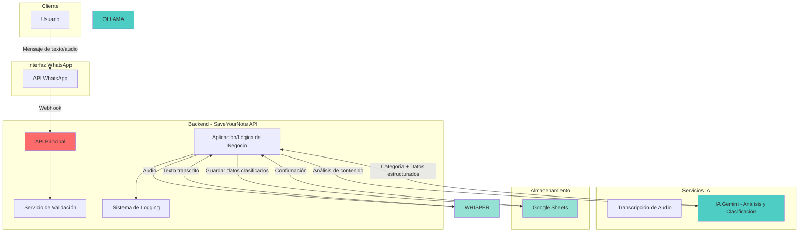
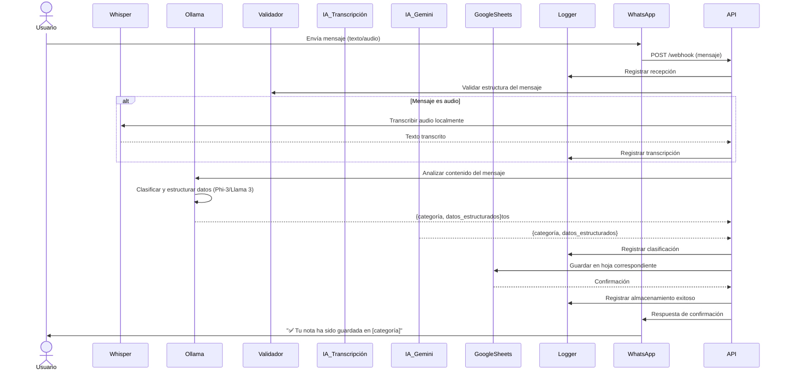
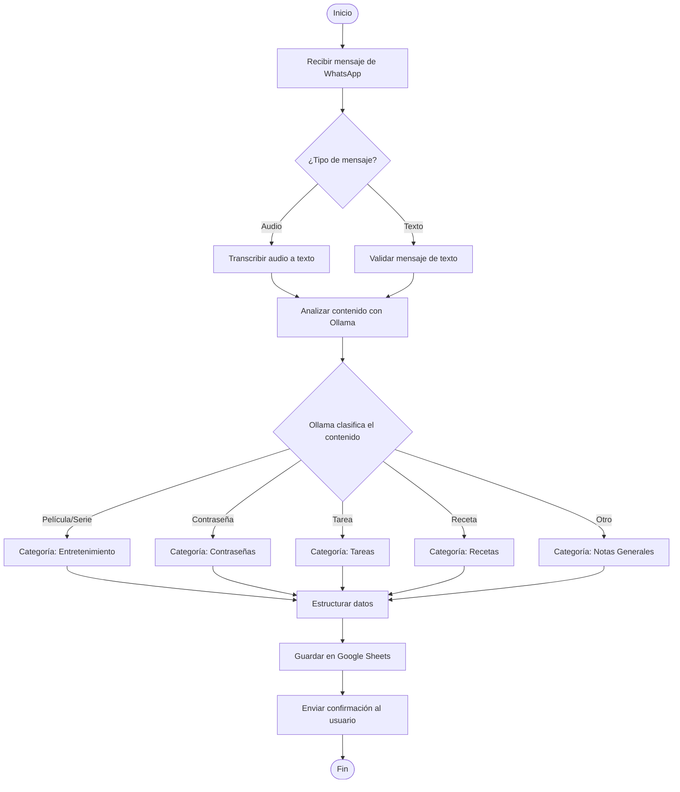
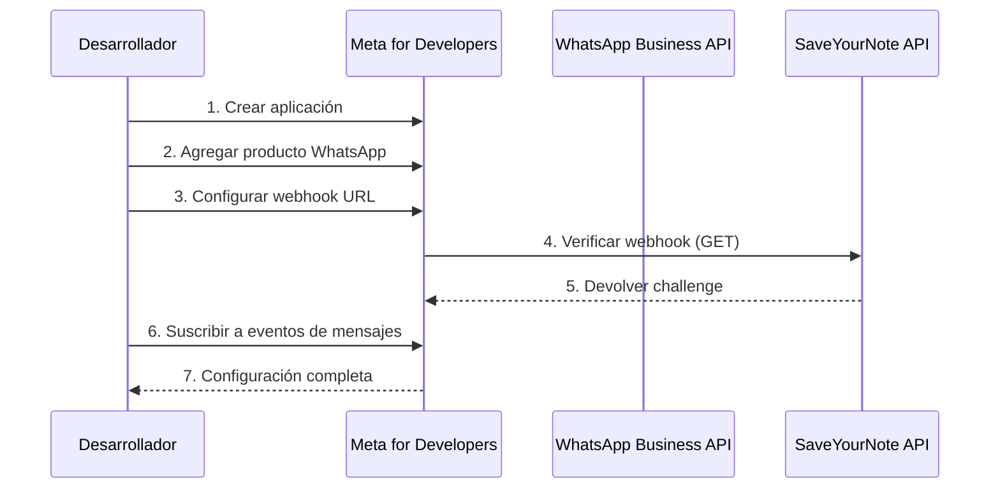
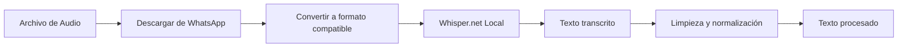
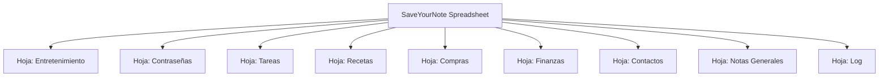
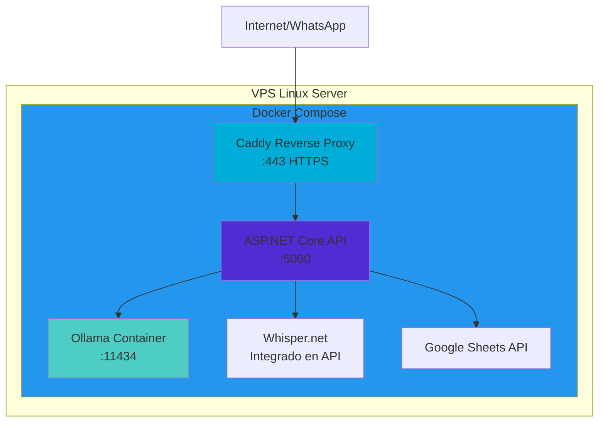

# SaveYourNote API

## Índice

1. [Descripción General](#descripción-general)
2. [Stack Tecnológico](#stack-tecnológico)
3. [Arquitectura del Sistema](#arquitectura-del-sistema)
4. [Flujo de Funcionamiento](#flujo-de-funcionamiento)
5. [Componentes Principales](#componentes-principales)
6. [Endpoints de la API](#endpoints-de-la-api)
7. [Integración con WhatsApp](#integración-con-whatsapp)
8. [Procesamiento con IA](#procesamiento-con-ia)
9. [Sistema de Almacenamiento](#sistema-de-almacenamiento)
10. [Infraestructura y Despliegue](#infraestructura-y-despliegue)
11. [Casos de Uso](#casos-de-uso)

---

## Descripción General

**SaveYourNote** es una API inteligente que permite a los usuarios guardar y clasificar automáticamente información enviada a través de WhatsApp. La aplicación procesa tanto mensajes de texto como archivos de audio, utiliza inteligencia artificial para comprender el contenido y lo almacena de forma organizada en categorías específicas.

### Objetivo Principal

Facilitar el almacenamiento rápido y organizado de información desde WhatsApp, clasificando automáticamente el contenido según su naturaleza (películas, contraseñas, tareas, recetas, etc.).

### Características Principales

- ✅ Recepción de mensajes de texto y audio vía WhatsApp
- ✅ Transcripción automática de mensajes de audio usando IA local (Whisper)
- ✅ Análisis inteligente del contenido mediante IA local (Ollama con Phi-3/Llama 3)
- ✅ Clasificación automática en categorías
- ✅ Almacenamiento organizado en Google Sheets
- ✅ Sistema de logging para trazabilidad
- ✅ Validación de datos
- ✅ Procesamiento 100% local (privacidad garantizada)
- ✅ Infraestructura containerizada con Docker

---

## Stack Tecnológico

### Backend y API

| Tecnología           | Versión | Propósito                            |
| -------------------- | ------- | ------------------------------------ |
| **ASP.NET Core API** | .NET 10 | Framework principal para la API REST |
| **C#**               | 12.0    | Lenguaje de programación             |

### Modelos de IA (Ejecución Local)

| Tecnología          | Propósito                                           |
| ------------------- | --------------------------------------------------- |
| **Whisper.net**     | Transcripción de audio a texto (modelo local)       |
| **Ollama**          | Servidor de LLM local para análisis y clasificación |
| **Phi-3 / Llama 3** | Modelos de lenguaje ejecutándose en Ollama          |

### Integraciones Externas

- WHISPER[Whisper.net - Transcripción]
- OLLAMA[Ollama - LLM Local]
- PHI3[Phi-3/Llama 3]

### Infraestructura

| Tecnología         | Propósito                                       |
| ------------------ | ----------------------------------------------- |
| **Docker**         | Containerización de servicios                   |
| **Docker Compose** | Orquestación de contenedores                    |
| **Caddy**          | Reverse proxy con HTTPS automático              |
| **VPS Linux**      | Servidor en la nube (DigitalOcean, Vultr, etc.) |

### DevOps y CI/CD

| Tecnología                    | Propósito                                    |
| ----------------------------- | -------------------------------------------- |
| **Git / GitHub**              | Control de versiones y repositorio de código |
| **GitHub Actions**            | Pipeline de CI/CD automatizado               |
| **GitHub Container Registry** | Almacenamiento de imágenes Docker            |

---

## Arquitectura del Sistema



---

## Flujo de Funcionamiento

### Diagrama de Secuencia



### Flujo de Decisión



---

## Componentes Principales

### 1. API Principal (ASP.NET Core)

**Responsabilidad:** Orquestador central del sistema que recibe y procesa las solicitudes.

**Tecnología:** ASP.NET Core API (.NET 10) con C#

**Funcionalidades:**

- Recepción de webhooks de WhatsApp
- Enrutamiento de mensajes
- Coordinación entre servicios (Whisper, Ollama, Google Sheets)
- Gestión de respuestas
- Validación y autenticación

### 2. Servicio de Validación

**Responsabilidad:** Validar la integridad y formato de los mensajes recibidos.

**Validaciones:**

- Estructura del mensaje de WhatsApp
- Formato de datos

### 3. Módulo de Transcripción (Whisper.net)

**Responsabilidad:** Convertir mensajes de audio a texto de forma local.

**Tecnología:** Whisper.net (wrapper de .NET para Whisper de OpenAI)

**Características:**

- Ejecución 100% local (sin llamadas a APIs externas)
- Soporte para español
- Privacidad garantizada (audio no sale del servidor)

### 4. Motor de IA Local (Ollama)

**Responsabilidad:** Analizar, clasificar y estructurar el contenido mediante LLM local.

**Tecnología:** Ollama ejecutando Phi-3 o Llama 3

**Tareas:**

- Comprensión del contexto del mensaje
- Clasificación en categorías
- Extracción de datos relevantes
- Estructuración de información en JSON
- Generación de respuestas al usuario

**Ventajas:**

- Ejecución local (privacidad total)
- Sin costos por uso de API
- Respuestas rápidas
- Control total del modelo

- Comprensión del contexto del mensaje
- Clasificación en categorías
- Extracción de datos relevantes
- Estructuración de información

### 5. Gestor de Almacenamiento

**Responsabilidad:** Persistir los datos clasificados en Google Sheets.

**Funcionalidades:**

- Conexión con Google Sheets API
- Escritura en hojas específicas por categoría
- Formato de datos
- Manejo de errores de escritura

### 6. Sistema de Logging

**Responsabilidad:** Registrar todas las operaciones del sistema.

**Información registrada:**

- Mensajes recibidos
- Transcripciones realizadas
- Clasificaciones
- Almacenamientos exitosos/fallidos
- Errores y excepciones

---

## Endpoints de la API

### POST /webhook

Endpoint principal para recibir mensajes de WhatsApp.

**Headers:**

```
Content-Type: application/json
X-Hub-Signature: [firma de verificación de WhatsApp]
```

**Body - Mensaje de Texto:**

```json
{
  "object": "whatsapp_business_account",
  "entry": [
    {
      "id": "WHATSAPP_BUSINESS_ACCOUNT_ID",
      "changes": [
        {
          "value": {
            "messaging_product": "whatsapp",
            "metadata": {
              "display_phone_number": "PHONE_NUMBER",
              "phone_number_id": "PHONE_NUMBER_ID"
            },
            "contacts": [
              {
                "profile": {
                  "name": "CONTACT_NAME"
                },
                "wa_id": "WHATSAPP_ID"
              }
            ],
            "messages": [
              {
                "from": "SENDER_PHONE_NUMBER",
                "id": "MESSAGE_ID",
                "timestamp": "TIMESTAMP",
                "type": "text",
                "text": {
                  "body": "Recordar ver Inception esta noche"
                }
              }
            ]
          }
        }
      ]
    }
  ]
}
```

**Body - Mensaje de Audio:**

```json
{
  "object": "whatsapp_business_account",
  "entry": [
    {
      "id": "WHATSAPP_BUSINESS_ACCOUNT_ID",
      "changes": [
        {
          "value": {
            "messages": [
              {
                "from": "SENDER_PHONE_NUMBER",
                "id": "MESSAGE_ID",
                "timestamp": "TIMESTAMP",
                "type": "audio",
                "audio": {
                  "mime_type": "audio/ogg; codecs=opus",
                  "sha256": "HASH",
                  "id": "AUDIO_ID"
                }
              }
            ]
          }
        }
      ]
    }
  ]
}
```

**Respuesta Exitosa:**

```json
{
  "status": "success",
  "message": "Mensaje procesado correctamente",
  "data": {
    "category": "entretenimiento",
    "saved_to": "Películas y Series",
    "timestamp": "2025-12-05T10:30:00Z"
  }
}
```

**Respuesta de Error:**

```json
{
  "status": "error",
  "message": "No se pudo procesar el mensaje",
  "error_code": "TRANSCRIPTION_FAILED",
  "details": "El audio no pudo ser transcrito"
}
```

### GET /webhook

Endpoint de verificación para WhatsApp.

**Query Parameters:**

- `hub.mode`: "subscribe"
- `hub.verify_token`: Token de verificación
- `hub.challenge`: Desafío a devolver

**Respuesta:**

```
200 OK
[hub.challenge value]
```

### GET /health

Endpoint de verificación de estado del servicio.

**Respuesta:**

```json
{
  "status": "healthy",
  "timestamp": "2025-12-05T10:30:00Z",
  "services": {
    "api": "online",
    "gemini": "online",
    "google_sheets": "online",
    "transcription": "online"
  }
}
```

---

## Integración con WhatsApp

### Configuración Inicial



### Pasos de Configuración

1. **Crear cuenta en Meta for Developers**

   - Acceder a https://developers.facebook.com/
   - Crear nueva aplicación
   - Seleccionar tipo "Business"

2. **Configurar WhatsApp Business API**

   - Agregar producto "WhatsApp"
   - Obtener número de teléfono de prueba

## Procesamiento con IA

### 1. Transcripción de Audio (Whisper.net)

**Flujo de Transcripción:**



**Implementación con Whisper.net:**

```csharp
// Ejemplo de implementación en C#
public async Task<string> TranscribeAudioAsync(Stream audioStream)
{
    using var whisperFactory = WhisperFactory.FromPath("models/ggml-base.bin");
    using var processor = whisperFactory.CreateBuilder()
        .WithLanguage("es")
        .Build();

    var segments = new List<string>();

    await foreach (var segment in processor.ProcessAsync(audioStream))
    {
        segments.Add(segment.Text);
    }

    return string.Join(" ", segments);
}
```

**Modelos disponibles:**

- `ggml-tiny.bin` - Más rápido, menos preciso (~75 MB)
- `ggml-base.bin` - Equilibrio recomendado (~142 MB)
- `ggml-small.bin` - Mayor precisión (~466 MB)
- `ggml-medium.bin` - Muy preciso (~1.5 GB)

### 2. Análisis y Clasificación con Ollama

**Configuración de Ollama:**

```bash
# Instalar Ollama en el servidor
curl -fsSL https://ollama.com/install.sh | sh

# Descargar modelo (ejemplo con Phi-3)
ollama pull phi3:mini
# o con Llama 3
ollama pull llama3:8b
```

**Prompt para Ollama:** # Transcribir con Whisper
result = whisper_client.transcribe(
audio_file,
language="es", # Español
**Implementación con Ollama en C#:**

```csharp
public async Task<ClasificacionResponse> ClasificarMensajeAsync(string mensaje)
{
    var httpClient = new HttpClient();
    var ollamaRequest = new
    {
        model = "phi3:mini",
        prompt = $@"Analiza el siguiente mensaje y clasifícalo en una de estas categorías:
- entretenimiento (películas, series, libros, música)
- contraseñas (credenciales, passwords, accesos)
- tareas (pendientes, recordatorios, to-do)
- recetas (comida, cocina, ingredientes)
- compras (lista de compras, productos)
- finanzas (gastos, pagos, facturas)
- contactos (personas, teléfonos, emails)
- notas (información general, ideas)

Mensaje: ""{mensaje}""

Responde SOLO en formato JSON válido sin markdown:
{{
  ""categoria"": ""nombre_categoria"",
  ""titulo"": ""título descriptivo"",
  ""datos"": {{
    // campos específicos según categoría
  }},
  ""confianza"": 0.95
}}",
        stream = false,
        format = "json"
    };

    var response = await httpClient.PostAsJsonAsync(
        "http://localhost:11434/api/generate",
        ollamaRequest
    );

    var result = await response.Content.ReadFromJsonAsync<OllamaResponse>();
    return JsonSerializer.Deserialize<ClasificacionResponse>(result.Response);
}
```

**Ejemplos de Respuestas de Ollama:**
)

    return result["text"]

```

### 2. Análisis y Clasificación con Gemini

**Prompt para Gemini:**

```

Analiza el siguiente mensaje y clasifícalo en una de estas categorías:

- entretenimiento (películas, series, libros, música)
- contraseñas (credenciales, passwords, accesos)
- tareas (pendientes, recordatorios, to-do)
- recetas (comida, cocina, ingredientes)
- compras (lista de compras, productos)
- finanzas (gastos, pagos, facturas)
- contactos (personas, teléfonos, emails)
- notas (información general, ideas)

Mensaje: "{mensaje_del_usuario}"

Responde en formato JSON:
{
"categoria": "nombre_categoria",
"titulo": "título descriptivo",
"datos": {
// campos específicos según categoría
},
"confianza": 0.95
}

````

**Ejemplos de Respuestas de Gemini:**

**Ejemplo 1 - Película:**

```json
{
  "categoria": "entretenimiento",
  "titulo": "Película: Inception",
  "datos": {
    "tipo": "película",
    "nombre": "Inception",
    "nota": "Ver esta noche",
    "fecha_agregada": "2025-12-05"
  },
  "confianza": 0.98
}
````

**Ejemplo 2 - Contraseña:**

```json
{
  "categoria": "contraseñas",
  "titulo": "Netflix - Acceso",
  "datos": {
    "servicio": "Netflix",
    "usuario": "miusuario@email.com",
    "contraseña": "****", // Censurada en respuesta
    "notas": "Cuenta familiar",
    "fecha_agregada": "2025-12-05"
  },
  "confianza": 0.95
}
```

**Ejemplo 3 - Tarea:**

```json
{
  "categoria": "tareas",
  "titulo": "Comprar leche mañana",
  "datos": {
    "tarea": "Comprar leche",
    "fecha_limite": "2025-12-06",
    "prioridad": "media",
    "estado": "pendiente"
  },
  "confianza": 0.92
}
```

---

## Sistema de Almacenamiento

### Estructura de Google Sheets

**Organización del Spreadsheet:**



### Esquemas de Hojas

#### Hoja: Entretenimiento

| Timestamp        | Tipo     | Nombre    | Género | Estado    | Notas          | Usuario      |
| ---------------- | -------- | --------- | ------ | --------- | -------------- | ------------ |
| 2025-12-05 10:30 | Película | Inception | Sci-Fi | Pendiente | Ver esta noche | +34612345678 |

#### Hoja: Contraseñas

| Timestamp        | Servicio | Usuario/Email  | Contraseña | URL         | Notas           | Usuario      |
| ---------------- | -------- | -------------- | ---------- | ----------- | --------------- | ------------ |
| 2025-12-05 10:35 | Netflix  | user@email.com | [CIFRADA]  | netflix.com | Cuenta familiar | +34612345678 |

**⚠️ Consideración de Seguridad:** Las contraseñas deben cifrarse antes de almacenarse.

#### Hoja: Tareas

    Usuario->>WA: "Quiero ver Interstellar este fin de semana"
    WA->>API: POST /webhook (mensaje)
    API->>Ollama: Analizar mensaje
    Note over Ollama: Detecta: película "Interstellar"<br/>Categoría: entretenimiento
    Ollama-->>API: {categoria: "entretenimiento", datos: {...}}
    API->>Sheets: Guardar en hoja "Entretenimiento"

| Timestamp        | Nombre Receta | Ingredientes      | Pasos         | Categoría | Tiempo | Usuario      |
| ---------------- | ------------- | ----------------- | ------------- | --------- | ------ | ------------ |
| 2025-12-05 11:00 | Paella        | Arroz, azafrán... | 1. Sofreír... | Principal | 45 min | +34612345678 |

#### Hoja: Log

| Timestamp        | Evento           | Usuario      | Categoría       | Estado  | Detalles        |
| ---------------- | ---------------- | ------------ | --------------- | ------- | --------------- |
| 2025-12-05 10:30 | mensaje_recibido | +34612345678 | -               | success | Tipo: texto     |
| 2025-12-05 10:30 | transcripcion    | +34612345678 | -               | success | Audio -> Texto  |
| 2025-12-05 10:30 | clasificacion    | +34612345678 | entretenimiento | success | Confianza: 0.98 |
| 2025-12-05 10:30 | almacenamiento   | +34612345678 | entretenimiento | success | Google Sheets   |

## Infraestructura y Despliegue

### Arquitectura de Contenedores



### Estructura de Docker Compose

**docker-compose.yml:**

```yaml
version: "3.8"

services:
  # API Principal .NET
  api:
    build: ./src/SaveYourNote.API
    container_name: saveyournote-api
    ports:
      - "5000:8080"
    environment:
      - ASPNETCORE_ENVIRONMENT=Production
      - OLLAMA_URL=http://ollama:11434
      - WHATSAPP_API_TOKEN=${WHATSAPP_API_TOKEN}
      - WHATSAPP_VERIFY_TOKEN=${WHATSAPP_VERIFY_TOKEN}
      - GOOGLE_SHEET_ID=${GOOGLE_SHEET_ID}
    volumes:
      - ./data/whisper-models:/app/models
      - ./data/credentials:/app/credentials:ro
    depends_on:
      - ollama
    restart: unless-stopped

  # Ollama (LLM Local)
  ollama:
    image: ollama/ollama:latest
    container_name: saveyournote-ollama
    ports:
      - "11434:11434"
    volumes:
      - ./data/ollama:/root/.ollama
    restart: unless-stopped
    deploy:
      resources:
        reservations:
          devices:
            - driver: nvidia
              count: 1
              capabilities: [gpu] # Opcional: si tienes GPU

  # Caddy (Reverse Proxy)
  caddy:
    image: caddy:latest
    container_name: saveyournote-caddy
    ports:
      - "80:80"
      - "443:443"
    volumes:
      - ./Caddyfile:/etc/caddy/Caddyfile
      - ./data/caddy:/data
    depends_on:
      - api
    restart: unless-stopped
```

### Pipeline CI/CD con GitHub Actions

**.github/workflows/deploy.yml:**

```yaml
name: Build and Deploy

on:
  push:
    branches: [main]
  workflow_dispatch:

env:
  REGISTRY: ghcr.io
  IMAGE_NAME: ${{ github.repository }}

jobs:
  build-and-push:
    runs-on: ubuntu-latest
    permissions:
      contents: read
      packages: write

    steps:
      - name: Checkout repository
        uses: actions/checkout@v4

      - name: Log in to Container Registry
        uses: docker/login-action@v3
        with:
          registry: ${{ env.REGISTRY }}
          username: ${{ github.actor }}
          password: ${{ secrets.GITHUB_TOKEN }}

      - name: Extract metadata
        id: meta
        uses: docker/metadata-action@v5
        with:
          images: ${{ env.REGISTRY }}/${{ env.IMAGE_NAME }}

      - name: Build and push Docker image
        uses: docker/build-push-action@v5
        with:
          context: ./src/SaveYourNote.API
          push: true
          tags: ${{ steps.meta.outputs.tags }}
          labels: ${{ steps.meta.outputs.labels }}

  deploy:
    needs: build-and-push
    runs-on: ubuntu-latest

    steps:
      - name: Deploy to VPS
        uses: appleboy/ssh-action@master
        with:
          host: ${{ secrets.VPS_HOST }}
          username: ${{ secrets.VPS_USER }}
          key: ${{ secrets.VPS_SSH_KEY }}
          script: |
            cd /opt/saveyournote
            docker compose pull api
            docker compose up -d api
            docker image prune -f
```

### Requisitos del Servidor VPS

**Especificaciones mínimas:**

- **CPU:** 4 cores (recomendado para Ollama)
- **RAM:** 8 GB mínimo (16 GB recomendado)
- **Almacenamiento:** 50 GB SSD
- **SO:** Ubuntu 22.04 LTS o Debian 12
- **GPU:** Opcional (mejora rendimiento de Ollama)

**Software requerido:**

```bash
# Docker
curl -fsSL https://get.docker.com -o get-docker.sh
sh get-docker.sh

# Docker Compose
sudo apt-get install docker-compose-plugin

# Ollama (se ejecuta en contenedor)
# Whisper models (se descargan automáticamente)
```

### Comandos de Despliegue

**Instalación inicial:**

```bash
# Clonar repositorio
git clone https://github.com/industrial-dev/saveyournote.git
cd saveyournote

# Configurar variables de entorno
cp .env.example .env
nano .env  # Editar con tus valores

# Descargar modelo de Whisper
mkdir -p data/whisper-models
cd data/whisper-models
wget https://huggingface.co/ggerganov/whisper.cpp/resolve/main/ggml-base.bin

# Iniciar servicios
docker compose up -d

# Descargar modelo de Ollama
docker exec saveyournote-ollama ollama pull phi3:mini
```

**Actualización:**

```bash
git pull
docker compose pull
docker compose up -d
```

### Seguridad

#### Medidas de Seguridad Implementadas

1. **Validación de Webhook**

   - Verificar firma X-Hub-Signature-256 de WhatsApp en ASP.NET
   - Validar origen de las peticiones

2. **Cifrado de Contraseñas**

   - Usar AES-256 con `System.Security.Cryptography`
   - Almacenar clave de cifrado en variable de entorno segura
   - Nunca mostrar contraseñas en logs

3. **Autenticación de Servicios**

   - OAuth 2.0 para Google Sheets con Service Account
   - Credenciales montadas como volumen de solo lectura
   - Comunicación interna entre contenedores (red privada de Docker)

4. **Privacidad de Datos**

   - Procesamiento 100% local (audio y texto no salen del servidor)
   - Modelos de IA ejecutándose localmente
   - Sin llamadas a APIs externas de IA

5. **HTTPS y Reverse Proxy**

   - Caddy gestiona automáticamente certificados SSL (Let's Encrypt)
   - Todo el tráfico cifrado
   - Headers de seguridad configurados

6. **Límites y Rate Limiting**

   - Middleware de rate limiting en ASP.NET Core
   - Máximo de mensajes por usuario/día
   - Tamaño máximo de archivos de audio (16 MB)
   - Timeout en procesamiento de IA

7. **Logging Seguro**
   - Serilog con rotación de archivos
   - No registrar contenido sensible
   - Anonimizar números de teléfono en logs
   - Logs almacenados en volúmenes de Docker

---SPER_MODEL_PATH=/app/models/ggml-base.bin

# Configuración de la API

ASPNETCORE_ENVIRONMENT=Production
ASPNETCORE_URLS=http://+:8080

# Seguridad

ENCRYPTION_KEY=your_encryption_key_for_passwords_min_32_chars

````

### Dependencias NuGet (.NET)

**SaveYourNote.API.csproj:**

```xml
<Project Sdk="Microsoft.NET.Sdk.Web">
  <PropertyGroup>
    <TargetFramework>net8.0</TargetFramework>
    <Nullable>enable</Nullable>
  </PropertyGroup>

  <ItemGroup>
    <!-- ASP.NET Core -->
    <PackageReference Include="Microsoft.AspNetCore.OpenApi" Version="8.0.*" />

    <!-- Whisper.net para transcripción -->
    <PackageReference Include="Whisper.net" Version="1.5.0" />
    <PackageReference Include="Whisper.net.Runtime" Version="1.5.0" />

    <!-- Google Sheets API -->
    <PackageReference Include="Google.Apis.Sheets.v4" Version="1.68.*" />
    <PackageReference Include="Google.Apis.Auth" Version="1.68.*" />

    <!-- HTTP Client para Ollama -->
    <PackageReference Include="System.Net.Http.Json" Version="8.0.*" />

    <!-- Seguridad -->
    <PackageReference Include="System.Security.Cryptography.Algorithms" Version="4.3.1" />

    <!-- Logging -->
    <PackageReference Include="Serilog.AspNetCore" Version="8.0.*" />
    <PackageReference Include="Serilog.Sinks.File" Version="5.0.*" />
  </ItemGroup>
</Project>
````

### Seguridad

#### Medidas de Seguridad Implementadas

1. **Validación de Webhook**

   - Verificar firma X-Hub-Signature-256 de WhatsApp en ASP.NET
   - Validar origen de las peticiones

2. **Cifrado de Contraseñas**

   - Usar AES-256 con `System.Security.Cryptography`
   - Almacenar clave de cifrado en variable de entorno segura
   - Nunca mostrar contraseñas en logs

3. **Autenticación de Servicios**

   - OAuth 2.0 para Google Sheets con Service Account
   - Credenciales montadas como volumen de solo lectura
   - Comunicación interna entre contenedores (red privada de Docker)

4. **Privacidad de Datos**

   - Procesamiento 100% local (audio y texto no salen del servidor)
   - Modelos de IA ejecutándose localmente
   - Sin llamadas a APIs externas de IA

5. **HTTPS y Reverse Proxy**

   - Caddy gestiona automáticamente certificados SSL (Let's Encrypt)
   - Todo el tráfico cifrado
   - Headers de seguridad configurados

6. **Límites y Rate Limiting**

   - Middleware de rate limiting en ASP.NET Core
   - Máximo de mensajes por usuario/día
   - Tamaño máximo de archivos de audio (16 MB)
   - Timeout en procesamiento de IA

7. **Logging Seguro**
   - Serilog con rotación de archivos
   - No registrar contenido sensible
   - Anonimizar números de teléfono en logs
   - Logs almacenados en volúmenes de Docker

---

## Roadmap y Mejoras Futuras

### Fase 1 - MVP (Mínimo Producto Viable)

- ✅ Recepción de mensajes de texto
- ✅ Clasificación básica (3-4 categorías)
- ✅ Almacenamiento en Google Sheets
- ✅ Respuestas de confirmación

### Fase 2 - Funcionalidades Avanzadas

- 🔄 Soporte para mensajes de audio con Whisper.net
- 🔄 Optimización del modelo Ollama
- 🔄 Más categorías de clasificación
- 🔄 Sistema de logging completo con Serilog
- 🔄 Dashboard de monitoreo

### Fase 3 - Optimizaciones

- 📋 Búsqueda de notas guardadas
- 📋 Comandos especiales (ej: "/buscar película")
- 📋 Estadísticas de uso
- 📋 Exportación de datos
- 📋 Caché de respuestas con Redis
- 📋 Optimización de modelos (cuantización)

### Seguridad

#### Medidas de Seguridad Implementadas

1. **Validación de Webhook**

   - Verificar firma X-Hub-Signature de WhatsApp
   - Validar origen de las peticiones

2. **Cifrado de Contraseñas**

   - Usar AES-256 para cifrar contraseñas
   - Almacenar clave de cifrado en variable de entorno segura
   - Nunca mostrar contraseñas en logs

3. **Autenticación de Servicios**

   - OAuth 2.0 para Google Sheets
   - API Keys seguras para Gemini y transcripción
   - Rotación periódica de tokens

4. **Límites y Rate Limiting**

   - Máximo de mensajes por usuario/día
   - Tamaño máximo de archivos de audio
   - Timeout en procesamiento de IA

5. **Logging Seguro**
   - No registrar contenido sensible
   - Anonimizar números de teléfono en logs
   - Almacenamiento seguro de logs

---

## Roadmap y Mejoras Futuras

### Fase 1 - MVP (Mínimo Producto Viable)

- ✅ Recepción de mensajes de texto
- ✅ Clasificación básica (3-4 categorías)
- ✅ Almacenamiento en Google Sheets
- ✅ Respuestas de confirmación

### Fase 2 - Funcionalidades Avanzadas

- 🔄 Soporte para mensajes de audio
- 🔄 Transcripción con IA
- 🔄 Más categorías de clasificación
- 🔄 Sistema de logging completo

### Fase 3 - Optimizaciones

- 📋 Búsqueda de notas guardadas
- 📋 Comandos especiales (ej: "/buscar película")

### Fase 4 - Características Premium

- 📋 Recordatorios automáticos para tareas (Background Services)
- 📋 Integración con otros servicios (Notion, Trello)
- 📋 Análisis de sentimientos con modelos especializados
- 📋 Sugerencias inteligentes basadas en historial
- 📋 Modo multiusuario con permisos
- 📋 Procesamiento batch de múltiples mensajes
- 📋 Fine-tuning de modelos localess (Notion, Trello)
- 📋 Análisis de sentimientos

## Glosario

- **ASP.NET Core:** Framework web de Microsoft para crear APIs con C#
- **Webhook:** URL de callback que recibe notificaciones automáticas de WhatsApp
- **Whisper.net:** Biblioteca de .NET para transcribir audio a texto localmente
- **Ollama:** Servidor que ejecuta modelos de IA (LLM) localmente
- **Phi-3/Llama 3:** Modelos de lenguaje de código abierto
- **Docker:** Tecnología de contenedores para empaquetar aplicaciones
- **Docker Compose:** Herramienta para orquestar múltiples contenedores
- **Caddy:** Servidor web y reverse proxy con HTTPS automático
- **LLM:** Large Language Model (Modelo de Lenguaje Grande)
- **CI/CD:** Continuous Integration/Continuous Deployment
- **GitHub Actions:** Pipeline de automatización integrado en GitHub

## Recursos y Referencias

### Documentación Oficial

- **ASP.NET Core:** https://learn.microsoft.com/aspnet/core
- **WhatsApp Business API:** https://developers.facebook.com/docs/whatsapp
- **Whisper.net:** https://github.com/sandrohanea/whisper.net
- **Ollama:** https://ollama.com/
- **Docker:** https://docs.docker.com/
- **Caddy:** https://caddyserver.com/docs/
- **Google Sheets API:** https://developers.google.com/sheets/api

### Modelos de IA

- **Phi-3 (Microsoft):** https://ollama.com/library/phi3
- **Llama 3 (Meta):** https://ollama.com/library/llama3
- **Whisper (OpenAI):** https://github.com/openai/whisper

### Repositorio

- **GitHub:** https://github.com/industrial-dev/saveyournote

---

## Contacto y Soporte

Para más información sobre el desarrollo de esta API:

- **Repositorio:** https://github.com/industrial-dev/saveyournote
- **Documentación de WhatsApp Business API:** https://developers.facebook.com/docs/whatsapp
- **Google Gemini API:** https://ai.google.dev/
- **Google Sheets API:** https://developers.google.com/sheets/api

---

**Versión del Documento:** 1.0  
**Fecha de Última Actualización:** 5 de diciembre de 2025  
**Autor:** SaveYourNote Development Team
