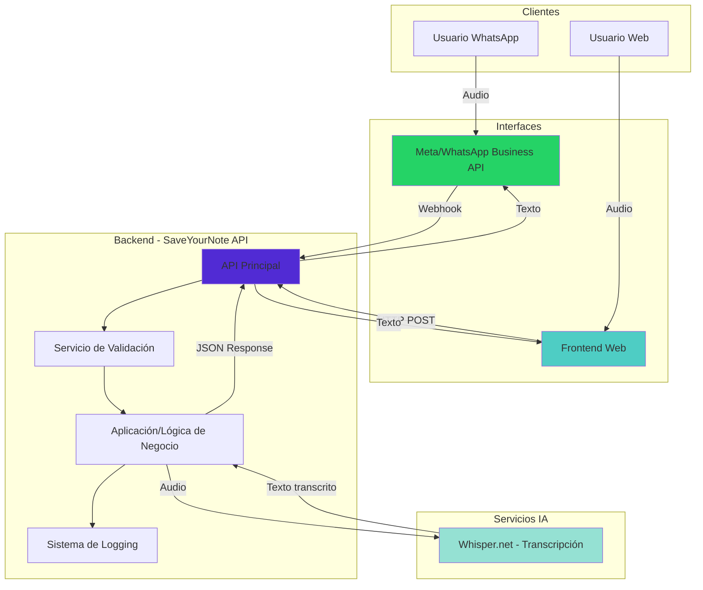
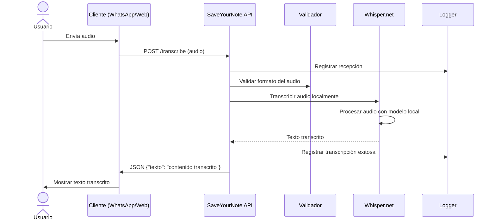
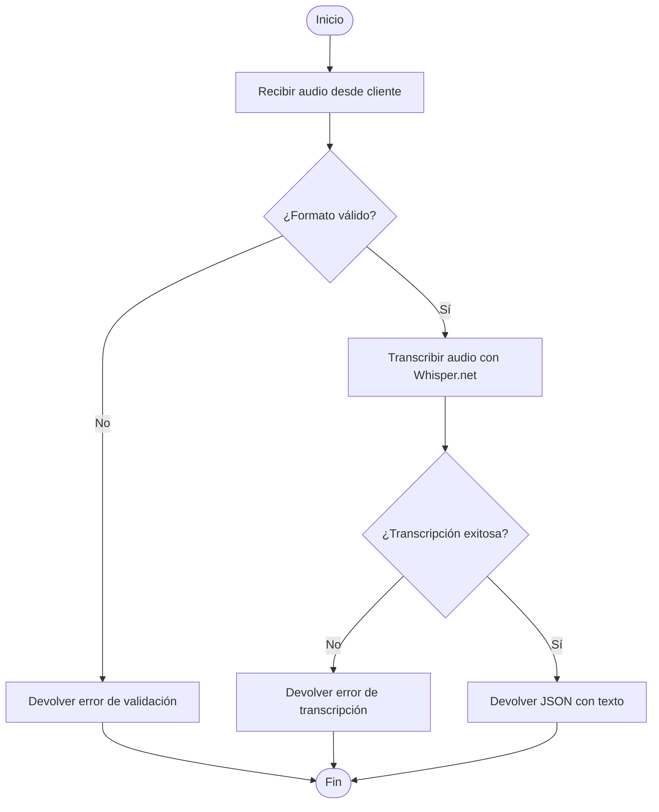
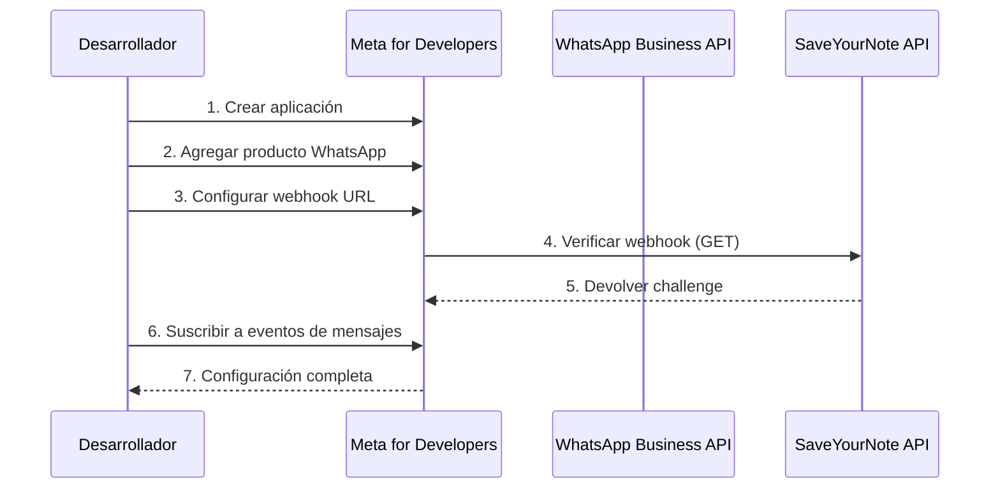
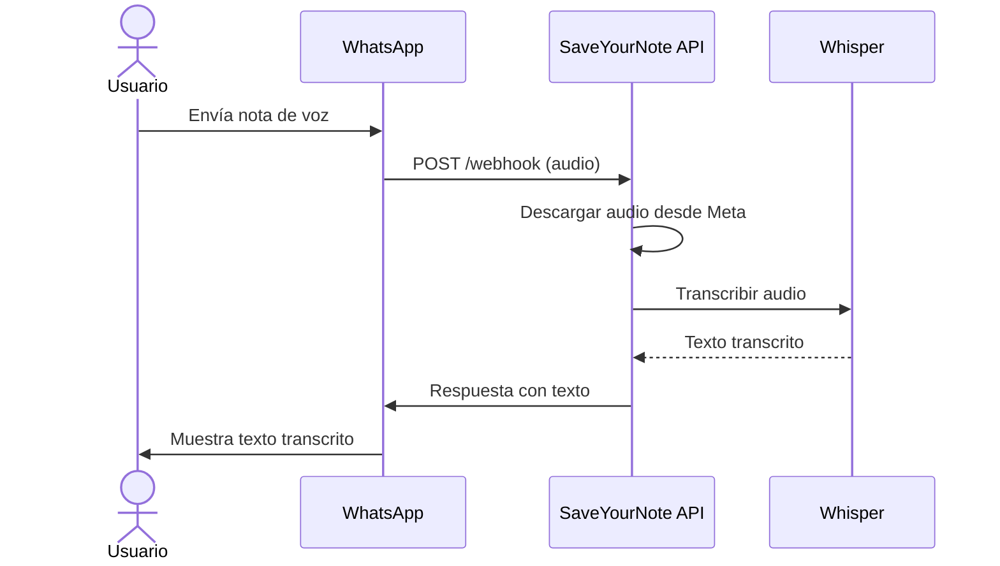
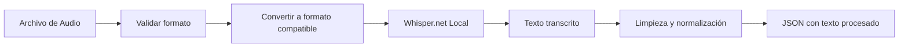
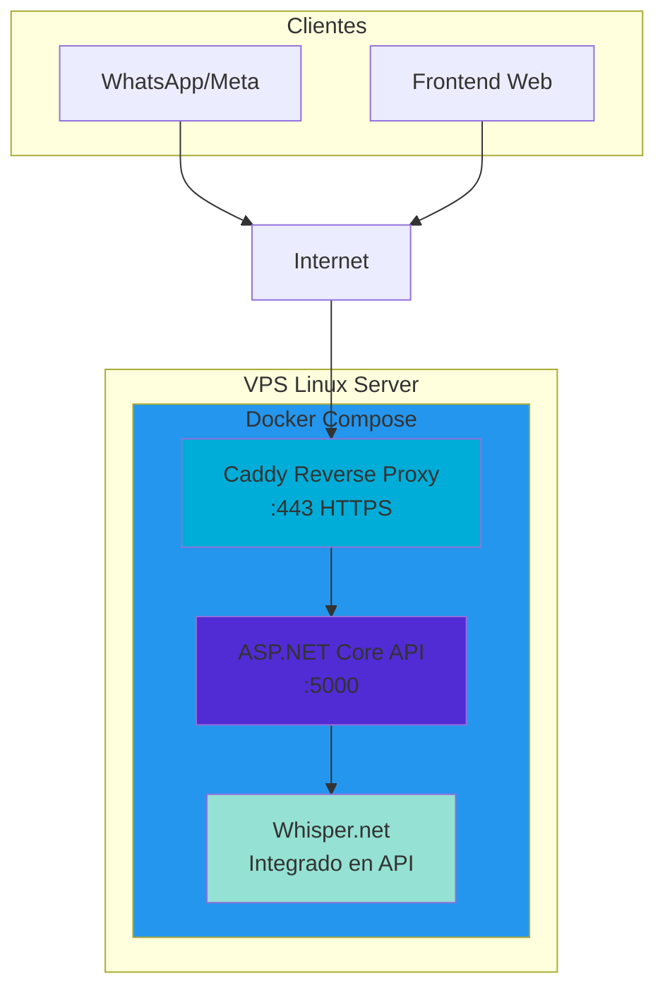

# SaveYourNote API

## Índice

1. [Descripción General](#descripción-general)
2. [Stack Tecnológico](#stack-tecnológico)
3. [Arquitectura del Sistema](#arquitectura-del-sistema)
4. [Flujo de Funcionamiento](#flujo-de-funcionamiento)
5. [Componentes Principales](#componentes-principales)
6. [Endpoints de la API](#endpoints-de-la-api)
7. [Integración con WhatsApp](#integración-con-whatsapp)
8. [Procesamiento con IA](#procesamiento-con-ia)
9. [Infraestructura y Despliegue](#infraestructura-y-despliegue)
10. [Casos de Uso](#casos-de-uso)

---

## Descripción General

**SaveYourNote** es una API de transcripción de audio que convierte archivos de audio a texto utilizando inteligencia artificial local. La aplicación recibe audios desde dos fuentes principales: mensajes de WhatsApp (a través de Meta) y un frontend web, procesa los archivos con Whisper y devuelve el texto transcrito.

### Objetivo Principal

Proporcionar un servicio de transcripción de audio rápido y preciso, exponiendo una API REST que puede ser consumida tanto por la integración de WhatsApp Business como por aplicaciones web frontend.

### Características Principales

- ✅ Recepción de archivos de audio vía API REST
- ✅ Transcripción automática de audio usando IA local (Whisper.net)
- ✅ Soporte para múltiples fuentes: WhatsApp (Meta) y frontend web
- ✅ Procesamiento 100% local (privacidad garantizada)
- ✅ Sistema de logging para trazabilidad
- ✅ Validación de datos
- ✅ Respuestas en formato JSON
- ✅ Infraestructura containerizada con Docker
- ✅ Alta precisión en transcripción en español

---

## 🚀 Inicio Rápido

### Opción 1: Con Docker (Recomendado)

```bash
# 1. Clonar el repositorio
git clone <repository-url>
cd saveyournote

# 2. Configurar variables de entorno
cp .env.example .env
# Edita .env y añade tu NGROK_AUTHTOKEN
# Obtén tu token en: https://dashboard.ngrok.com/get-started/your-authtoken

# 3. Iniciar con Docker
node docker.js start

# 4. Ver la URL de ngrok y configurar webhook en Meta
node docker.js url
```

### Opción 2: Ejecución Local (Sin Docker)

```bash
# 1. Clonar el repositorio
git clone <repository-url>
cd saveyournote

# 2. Instalar dependencias
dotnet restore

# 3. Ejecutar la API
cd src/SaveYourNote.Api
dotnet run

# 4. Abrir Swagger
open http://localhost:5001
```

Ver [WHATSAPP_SETUP.md](WHATSAPP_SETUP.md) para configurar ngrok manualmente.

### Configuración de WhatsApp

1. Ve a [Meta for Developers](https://developers.facebook.com/apps/)
2. Configura el webhook con la URL de ngrok
3. Prueba enviando un mensaje al número de WhatsApp

---

## 📋 Requisitos Previos

- **Con Docker**: Docker y Docker Compose
- **Sin Docker**: .NET SDK 10.0
- Cuenta de [Meta for Developers](https://developers.facebook.com/)
- Cuenta de [ngrok](https://ngrok.com/) (gratuita)
- Node.js 14.0 o superior (para el script de Docker multiplataforma)

```bash
# 1. Clonar el repositorio
git clone https://github.com/industrial-dev/saveyournote.git
cd saveyournote

# 2. Instalar dependencias (opcional, para scripts npm)
npm install
```

### Comandos de Docker Multiplataforma

El proyecto incluye un script multiplataforma en Node.js para gestionar Docker (funciona en Windows, Mac y Linux):

```bash
# Usando Node.js directamente
node docker.js start          # Iniciar en modo desarrollo
node docker.js stop           # Detener servicios
node docker.js logs           # Ver logs de todos los servicios
node docker.js logs api       # Ver logs de un servicio específico
node docker.js status         # Ver estado de los servicios
node docker.js url            # Mostrar URL de ngrok
node docker.js start prod     # Iniciar en modo producción

# O usando scripts npm (más cortos)
npm run docker:start          # Iniciar en modo desarrollo
npm run docker:stop           # Detener servicios
npm run docker:logs           # Ver logs
npm run docker:status         # Ver estado
npm run docker:url            # Mostrar URL de ngrok
npm run docker:prod           # Iniciar en producción
```

### Desarrollo Local (sin Docker)

1. **Iniciar la API:**

   ```bash
   cd src/SaveYourNote.Api
   dotnet run
   ```

   La API estará disponible en `http://localhost:5001`

2. **Verificar salud de la API:**

   ```bash
   curl http://localhost:5001/health
   ```

3. **Probar el webhook de WhatsApp:**
   Usa el archivo `src/SaveYourNote.Api/SaveYourNote.Api.http` en VS Code con la extensión REST Client

### Desarrollo con Docker

```bash
# Iniciar todos los servicios
npm run docker:start
# o: node docker.js start

# Ver logs de todos los servicios
npm run docker:logs
# o: node docker.js logs

# Ver logs de un servicio específico
node docker.js logs api

# Ver estado de los servicios
npm run docker:status
# o: node docker.js status

# Detener servicios
npm run docker:stop
# o: node docker.js stop
```

---

## Stack Tecnológico

### Backend y API

| Tecnología           | Versión | Propósito                            |
| -------------------- | ------- | ------------------------------------ |
| **ASP.NET Core API** | .NET 10 | Framework principal para la API REST |
| **C#**               | 12.0    | Lenguaje de programación             |

### Modelos de IA (Ejecución Local)

| Tecnología      | Propósito                                     |
| --------------- | --------------------------------------------- |
| **Whisper.net** | Transcripción de audio a texto (modelo local) |

### Integraciones Externas

- **WhatsApp Business API (Meta)**: Recepción de audios desde WhatsApp
- **Frontend Web**: Interfaz para subir audios directamente

### Infraestructura

| Tecnología         | Propósito                                       |
| ------------------ | ----------------------------------------------- |
| **Docker**         | Containerización de servicios                   |
| **Docker Compose** | Orquestación de contenedores                    |
| **Caddy**          | Reverse proxy con HTTPS automático              |
| **VPS Linux**      | Servidor en la nube (DigitalOcean, Vultr, etc.) |

### DevOps y CI/CD

| Tecnología                    | Propósito                                    |
| ----------------------------- | -------------------------------------------- |
| **Git / GitHub**              | Control de versiones y repositorio de código |
| **GitHub Actions**            | Pipeline de CI/CD automatizado               |
| **GitHub Container Registry** | Almacenamiento de imágenes Docker            |

---

## Arquitectura del Sistema



---

## Flujo de Funcionamiento

### Diagrama de Secuencia



### Flujo de Decisión



---

## Componentes Principales

### 1. API Principal (ASP.NET Core)

**Responsabilidad:** Orquestador central del sistema que recibe y procesa las solicitudes de transcripción.

**Tecnología:** ASP.NET Core API (.NET 10) con C#

**Funcionalidades:**

- Recepción de webhooks de WhatsApp
- Recepción de peticiones desde frontend web
- Enrutamiento de audios
- Coordinación con Whisper.net para transcripción
- Gestión de respuestas en formato JSON
- Validación y autenticación

### 2. Servicio de Validación

**Responsabilidad:** Validar la integridad y formato de los archivos de audio recibidos.

**Validaciones:**

- Estructura del mensaje de WhatsApp
- Formato de archivo de audio (codecs soportados)
- Tamaño máximo del archivo
- Duración máxima del audio

### 3. Módulo de Transcripción (Whisper.net)

**Responsabilidad:** Convertir archivos de audio a texto de forma local.

**Tecnología:** Whisper.net (wrapper de .NET para Whisper de OpenAI)

**Características:**

- Ejecución 100% local (sin llamadas a APIs externas)
- Soporte para español y múltiples idiomas
- Privacidad garantizada (audio no sale del servidor)
- Alta precisión en la transcripción
- Detección automática de idioma

### 4. Sistema de Logging

**Responsabilidad:** Registrar todas las operaciones del sistema.

**Información registrada:**

- Audios recibidos
- Transcripciones realizadas
- Transcripciones exitosas/fallidas
- Errores y excepciones
- Tiempos de procesamiento

---

## Endpoints de la API

### POST /transcribe

Endpoint principal para transcribir archivos de audio.

**Headers:**

```
Content-Type: multipart/form-data
Authorization: Bearer [token] (opcional, según configuración)
```

**Body:**

```
audio: [archivo de audio]
language: "es" (opcional, por defecto: detección automática)
```

**Formatos de audio soportados:**

- MP3
- WAV
- OGG
- M4A
- FLAC

**Respuesta Exitosa:**

```json
{
  "status": "success",
  "data": {
    "text": "Este es el texto transcrito del audio",
    "language": "es",
    "duration": 15.3,
    "confidence": 0.95
  },
  "timestamp": "2026-01-27T10:30:00Z"
}
```

**Respuesta de Error:**

```json
{
  "status": "error",
  "message": "No se pudo procesar el audio",
  "error_code": "TRANSCRIPTION_FAILED",
  "details": "El archivo de audio está corrupto o en un formato no soportado"
}
```

### POST /webhook

Endpoint para recibir audios desde WhatsApp (Meta).

**Headers:**

```
Content-Type: application/json
X-Hub-Signature-256: [firma de verificación de WhatsApp]
```

**Body - Mensaje de Audio desde WhatsApp:**

```json
{
  "object": "whatsapp_business_account",
  "entry": [
    {
      "id": "WHATSAPP_BUSINESS_ACCOUNT_ID",
      "changes": [
        {
          "value": {
            "messages": [
              {
                "from": "SENDER_PHONE_NUMBER",
                "id": "MESSAGE_ID",
                "timestamp": "TIMESTAMP",
                "type": "audio",
                "audio": {
                  "mime_type": "audio/ogg; codecs=opus",
                  "sha256": "HASH",
                  "id": "AUDIO_ID"
                }
              }
            ]
          }
        }
      ]
    }
  ]
}
```

**Respuesta Exitosa:**

```json
{
  "status": "success",
  "message": "Audio transcrito correctamente",
  "data": {
    "text": "Texto transcrito del audio de WhatsApp",
    "timestamp": "2026-01-27T10:30:00Z"
  }
}
```

### GET /webhook

Endpoint de verificación para WhatsApp.

**Query Parameters:**

- `hub.mode`: "subscribe"
- `hub.verify_token`: Token de verificación
- `hub.challenge`: Desafío a devolver

**Respuesta:**

```
200 OK
[hub.challenge value]
```

### GET /health

Endpoint de verificación de estado del servicio.

**Respuesta:**

```json
{
  "status": "healthy",
  "timestamp": "2026-01-27T10:30:00Z",
  "services": {
    "api": "online",
    "whisper": "online"
  }
}
```

---

## Integración con WhatsApp

### Configuración Inicial



### Pasos de Configuración

1. **Crear cuenta en Meta for Developers**
   - Acceder a https://developers.facebook.com/
   - Crear nueva aplicación
   - Seleccionar tipo "Business"

2. **Configurar WhatsApp Business API**
   - Agregar producto "WhatsApp"
   - Obtener número de teléfono de prueba
   - Configurar webhook para recibir solo mensajes de audio

3. **Configurar Webhook en SaveYourNote**
   - URL del webhook: `https://tu-dominio.com/webhook`
   - Suscribirse solo a eventos de tipo "audio"
   - Verificar que el token coincida

### Flujo de Uso desde WhatsApp



## Procesamiento con IA

### Transcripción de Audio (Whisper.net)

**Flujo de Transcripción:**



**Implementación con Whisper.net:**

```csharp
// Ejemplo de implementación en C#
public async Task<string> TranscribeAudioAsync(Stream audioStream, string language = "es")
{
    using var whisperFactory = WhisperFactory.FromPath("models/ggml-base.bin");
    using var processor = whisperFactory.CreateBuilder()
        .WithLanguage(language)
        .Build();

    var segments = new List<string>();

    await foreach (var segment in processor.ProcessAsync(audioStream))
    {
        segments.Add(segment.Text);
    }

    return string.Join(" ", segments);
}
```

**Modelos disponibles:**

- `ggml-tiny.bin` - Más rápido, menos preciso (~75 MB)
- `ggml-base.bin` - Equilibrio recomendado (~142 MB)
- `ggml-small.bin` - Mayor precisión (~466 MB)
- `ggml-medium.bin` - Muy preciso (~1.5 GB)

**Configuración recomendada:**

```csharp
var processor = whisperFactory.CreateBuilder()
    .WithLanguage("es")              // Idioma principal
    .WithThreads(4)                   // Número de hilos
    .WithTranslate(false)             // No traducir
    .WithSpeedup(false)               // Mejor calidad
    .Build();
```

**Características de Whisper.net:**

- **Precisión:** Alta precisión en español e inglés
- **Velocidad:** Depende del modelo seleccionado
- **Privacidad:** Procesamiento 100% local
- **Formatos:** Soporta MP3, WAV, OGG, M4A, FLAC
- **Idiomas:** Más de 90 idiomas soportados
- **Detección automática:** Puede detectar el idioma automáticamente

## Infraestructura y Despliegue

### Arquitectura de Contenedores



### Estructura de Docker Compose

**docker-compose.yml:**

```yaml
version: "3.8"

services:
  # API Principal .NET
  api:
    build: ./src/SaveYourNote.API
    container_name: saveyournote-api
    ports:
      - "5000:8080"
    environment:
      - ASPNETCORE_ENVIRONMENT=Production
      - WHATSAPP_API_TOKEN=${WHATSAPP_API_TOKEN}
      - WHATSAPP_VERIFY_TOKEN=${WHATSAPP_VERIFY_TOKEN}
      - WHISPER_MODEL_PATH=/app/models/ggml-base.bin
    volumes:
      - ./data/whisper-models:/app/models
      - ./data/logs:/app/logs
    restart: unless-stopped

  # Caddy (Reverse Proxy)
  caddy:
    image: caddy:latest
    container_name: saveyournote-caddy
    ports:
      - "80:80"
      - "443:443"
    volumes:
      - ./Caddyfile:/etc/caddy/Caddyfile
      - ./data/caddy:/data
    depends_on:
      - api
    restart: unless-stopped
```

### Pipeline CI/CD con GitHub Actions

**.github/workflows/deploy.yml:**

```yaml
name: Build and Deploy

on:
  push:
    branches: [main]
  workflow_dispatch:

env:
  REGISTRY: ghcr.io
  IMAGE_NAME: ${{ github.repository }}

jobs:
  build-and-push:
    runs-on: ubuntu-latest
    permissions:
      contents: read
      packages: write

    steps:
      - name: Checkout repository
        uses: actions/checkout@v4

      - name: Log in to Container Registry
        uses: docker/login-action@v3
        with:
          registry: ${{ env.REGISTRY }}
          username: ${{ github.actor }}
          password: ${{ secrets.GITHUB_TOKEN }}

      - name: Extract metadata
        id: meta
        uses: docker/metadata-action@v5
        with:
          images: ${{ env.REGISTRY }}/${{ env.IMAGE_NAME }}

      - name: Build and push Docker image
        uses: docker/build-push-action@v5
        with:
          context: ./src/SaveYourNote.API
          push: true
          tags: ${{ steps.meta.outputs.tags }}
          labels: ${{ steps.meta.outputs.labels }}

  deploy:
    needs: build-and-push
    runs-on: ubuntu-latest

    steps:
      - name: Deploy to VPS
        uses: appleboy/ssh-action@master
        with:
          host: ${{ secrets.VPS_HOST }}
          username: ${{ secrets.VPS_USER }}
          key: ${{ secrets.VPS_SSH_KEY }}
          script: |
            cd /opt/saveyournote
            docker compose pull api
            docker compose up -d api
            docker image prune -f
```

### Requisitos del Servidor VPS

**Especificaciones mínimas:**

- **CPU:** 2 cores
- **RAM:** 4 GB mínimo (8 GB recomendado para procesamiento de audio)
- **Almacenamiento:** 20 GB SSD
- **SO:** Ubuntu 22.04 LTS o Debian 12

**Software requerido:**

```bash
# Docker
curl -fsSL https://get.docker.com -o get-docker.sh
sh get-docker.sh

# Docker Compose
sudo apt-get install docker-compose-plugin
```

### Comandos de Despliegue

**Instalación inicial:**

```bash
# Clonar repositorio
git clone https://github.com/industrial-dev/saveyournote.git
cd saveyournote

# Configurar variables de entorno
cp .env.example .env
nano .env  # Editar con tus valores

# Descargar modelo de Whisper
mkdir -p data/whisper-models
cd data/whisper-models
wget https://huggingface.co/ggerganov/whisper.cpp/resolve/main/ggml-base.bin

# Iniciar servicios
cd ../..
docker compose up -d
```

**Actualización:**

```bash
git pull
docker compose pull
docker compose up -d
```

### Seguridad

#### Medidas de Seguridad Implementadas

1. **Validación de Webhook**
   - Verificar firma X-Hub-Signature-256 de WhatsApp en ASP.NET
   - Validar origen de las peticiones
   - Autenticación mediante tokens para frontend web

2. **Validación de Archivos**
   - Verificar formato y tipo MIME de archivos de audio
   - Tamaño máximo de archivos (16 MB)
   - Duración máxima de audio (5 minutos)

3. **Privacidad de Datos**
   - Procesamiento 100% local (audio no sale del servidor)
   - Whisper ejecutándose localmente
   - Sin llamadas a APIs externas de IA
   - Los audios se eliminan después de la transcripción

4. **HTTPS y Reverse Proxy**
   - Caddy gestiona automáticamente certificados SSL (Let's Encrypt)
   - Todo el tráfico cifrado
   - Headers de seguridad configurados

5. **Límites y Rate Limiting**
   - Middleware de rate limiting en ASP.NET Core
   - Máximo de transcripciones por usuario/día
   - Tamaño máximo de archivos de audio (16 MB)
   - Timeout en procesamiento de transcripción

6. **Logging Seguro**
   - Serilog con rotación de archivos
   - No registrar contenido de audio o texto sensible
   - Anonimizar números de teléfono en logs
   - Logs almacenados en volúmenes de Docker

7. **CORS**
   - Configuración de CORS para permitir solo dominios autorizados
   - Protección contra peticiones no autorizadas

**Variables de Entorno (.env):**

```bash
# WhatsApp API
WHATSAPP_API_TOKEN=tu_token_de_whatsapp
WHATSAPP_VERIFY_TOKEN=tu_token_de_verificacion
WHATSAPP_PHONE_NUMBER_ID=tu_phone_number_id

# Whisper
WHISPER_MODEL_PATH=/app/models/ggml-base.bin

# API Configuration
ASPNETCORE_ENVIRONMENT=Production
ASPNETCORE_URLS=http://+:8080

# Frontend (CORS)
ALLOWED_ORIGINS=https://tu-frontend.com,https://otro-dominio.com

```

### Dependencias NuGet (.NET)

**SaveYourNote.API.csproj:**

```xml
<Project Sdk="Microsoft.NET.Sdk.Web">
  <PropertyGroup>
    <TargetFramework>net10.0</TargetFramework>
    <Nullable>enable</Nullable>
  </PropertyGroup>

  <ItemGroup>
    <!-- ASP.NET Core -->
    <PackageReference Include="Microsoft.AspNetCore.OpenApi" Version="10.0.*" />

    <!-- Whisper.net para transcripción -->
    <PackageReference Include="Whisper.net" Version="1.5.0" />
    <PackageReference Include="Whisper.net.Runtime" Version="1.5.0" />

    <!-- HTTP Client -->
    <PackageReference Include="System.Net.Http.Json" Version="10.0.*" />

    <!-- Logging -->
    <PackageReference Include="Serilog.AspNetCore" Version="8.0.*" />
    <PackageReference Include="Serilog.Sinks.File" Version="5.0.*" />

    <!-- Rate Limiting -->
    <PackageReference Include="AspNetCoreRateLimit" Version="5.0.*" />
  </ItemGroup>
</Project>
```

### Seguridad

#### Medidas de Seguridad Implementadas

1. **Validación de Webhook**
   - Verificar firma X-Hub-Signature-256 de WhatsApp en ASP.NET
   - Validar origen de las peticiones

2. **Cifrado de Contraseñas**
   - Usar AES-256 con `System.Security.Cryptography`
   - Almacenar clave de cifrado en variable de entorno segura
   - Nunca mostrar contraseñas en logs

3. **Autenticación de Servicios**
   - OAuth 2.0 para Google Sheets con Service Account
   - Credenciales montadas como volumen de solo lectura
   - Comunicación interna entre contenedores (red privada de Docker)

4. **Privacidad de Datos**
   - Procesamiento 100% local (audio y texto no salen del servidor)
   - Modelos de IA ejecutándose localmente
   - Sin llamadas a APIs externas de IA

5. **HTTPS y Reverse Proxy**
   - Caddy gestiona automáticamente certificados SSL (Let's Encrypt)
   - Todo el tráfico cifrado
   - Headers de seguridad configurados

6. **Límites y Rate Limiting**
   - Middleware de rate limiting en ASP.NET Core
   - Máximo de mensajes por usuario/día
   - Tamaño máximo de archivos de audio (16 MB)
   - Timeout en procesamiento de IA

7. **Logging Seguro**
   - Serilog con rotación de archivos
   - No registrar contenido sensible
   - Anonimizar números de teléfono en logs
   - Logs almacenados en volúmenes de Docker

---

## Roadmap y Mejoras Futuras

### Fase 1 - MVP (Mínimo Producto Viable) ✅

- ✅ Recepción de archivos de audio
- ✅ Transcripción básica con Whisper.net
- ✅ API REST para transcripción
- ✅ Respuestas en formato JSON

### Fase 2 - Funcionalidades Avanzadas 🔄

- 🔄 Integración completa con WhatsApp Business API
- 🔄 Frontend web para subir audios
- 🔄 Sistema de logging completo con Serilog
- 🔄 Dashboard de monitoreo
- 🔄 Soporte para múltiples idiomas

### Fase 3 - Optimizaciones 📋

- 📋 Caché de transcripciones
- 📋 Transcripción en tiempo real (streaming)
- 📋 Mejora de rendimiento con GPU
- 📋 Estadísticas de uso
- 📋 Historial de transcripciones
- 📋 API de búsqueda de transcripciones

### Fase 4 - Características Premium 📋

- 📋 Procesamiento batch de múltiples audios
- 📋 Identificación de hablantes (diarization)
- 📋 Detección automática de idioma mejorada
- 📋 Exportación en múltiples formatos (SRT, VTT, TXT)
- 📋 Integración con servicios de almacenamiento (S3, Azure Blob)
- 📋 Modo multiusuario con autenticación

4. **Límites y Rate Limiting**
   - Máximo de mensajes por usuario/día
   - Tamaño máximo de archivos de audio
   - Timeout en procesamiento de IA

5. **Logging Seguro**
   - No registrar contenido sensible
   - Anonimizar números de teléfono en logs
   - Almacenamiento seguro de logs

---

## Roadmap y Mejoras Futuras

### Fase 1 - MVP (Mínimo Producto Viable)

- ✅ Recepción de mensajes de texto
- ✅ Clasificación básica (3-4 categorías)
- ✅ Almacenamiento en Google Sheets
- ✅ Respuestas de confirmación

### Fase 4 - Características Premium 📋

- 📋 Procesamiento batch de múltiples audios
- 📋 Identificación de hablantes (diarization)
- 📋 Detección automática de idioma mejorada
- 📋 Exportación en múltiples formatos (SRT, VTT, TXT)
- 📋 Integración con servicios de almacenamiento (S3, Azure Blob)
- 📋 Modo multiusuario con autenticación

---

## Glosario

- **ASP.NET Core:** Framework web de Microsoft para crear APIs con C#
- **Webhook:** URL de callback que recibe notificaciones automáticas de WhatsApp
- **Whisper.net:** Biblioteca de .NET para transcribir audio a texto localmente
- **Docker:** Tecnología de contenedores para empaquetar aplicaciones
- **Docker Compose:** Herramienta para orquestar múltiples contenedores
- **Caddy:** Servidor web y reverse proxy con HTTPS automático
- **CI/CD:** Continuous Integration/Continuous Deployment
- **GitHub Actions:** Pipeline de automatización integrado en GitHub
- **Rate Limiting:** Limitación de tasa de peticiones para prevenir abusos
- **CORS:** Cross-Origin Resource Sharing - permite peticiones desde otros dominios

## Recursos y Referencias

### Documentación Oficial

- **ASP.NET Core:** https://learn.microsoft.com/aspnet/core
- **WhatsApp Business API:** https://developers.facebook.com/docs/whatsapp
- **Whisper.net:** https://github.com/sandrohanea/whisper.net
- **Docker:** https://docs.docker.com/
- **Caddy:** https://caddyserver.com/docs/

### Modelos de IA

- **Whisper (OpenAI):** https://github.com/openai/whisper
- **Whisper.cpp:** https://github.com/ggerganov/whisper.cpp

### Repositorio

- **GitHub:** https://github.com/industrial-dev/saveyournote

---

## Contacto y Soporte

Para más información sobre el desarrollo de esta API:

- **Repositorio:** https://github.com/industrial-dev/saveyournote
- **Documentación de WhatsApp Business API:** https://developers.facebook.com/docs/whatsapp
- **Whisper.net GitHub:** https://github.com/sandrohanea/whisper.net

---

**Versión del Documento:** 2.0  
**Fecha de Última Actualización:** 27 de enero de 2026  
**Autor:** SaveYourNote Development Team
